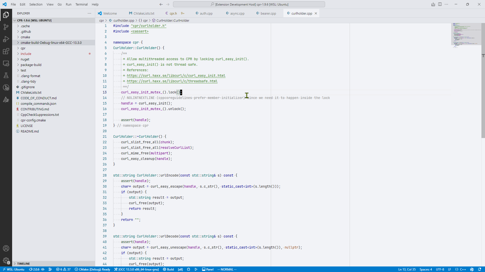

# vscode-gray-light-theme

Less color more focus.

This is a light gray theme for VSCode. It has few colors to help maintain focus.

Inspired by the Cyan Light Theme from IntelliJ CLion.

## Screenshots

